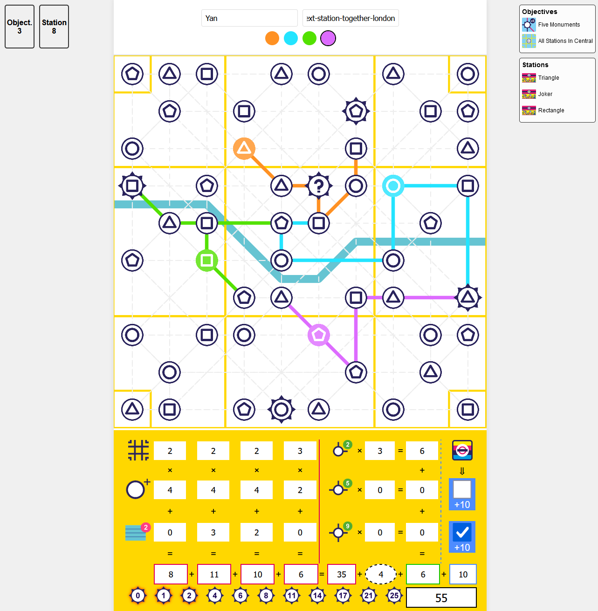
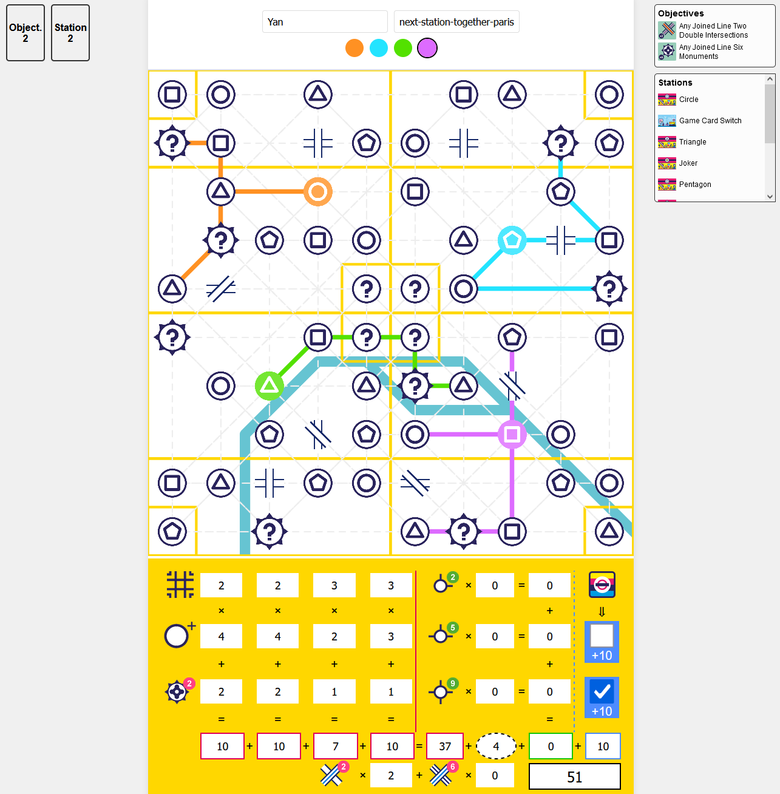

# Next Station Together

A highly customizable dynamic board generator and playable web interface for the board game series Next Station.
Rules are taken from the original games, as found in [sources.md](ref/sources.md).

<table>
  <tr>
    <td></td>
    <td></td>
  </tr>
</table>

## How to run this project

Open the [GameBoardTest.java](src/test/java/de/yanwittmann/nextstation/model/GameBoardTest.java) and either create your
own test that generates a board with custom parameters or use one of the existing tests to generate a board.
See the [BoardTemplates.java](src/main/java/de/yanwittmann/nextstation/setup/BoardTemplates.java)
and [BoardOptimizer.java](src/main/java/de/yanwittmann/nextstation/setup/BoardOptimizer.java) classes for details
on how to customize the board generation.

These tests produce a directory with the generated board in the [web](src/main/resources/web)/boards directory.
You must now share this directory with a web server to make it accessible to players,
such as by using `python -m http.server`.
Other players can now access the board by opening the URL of the web server in their browser.
The boards each have an id, which is their directory name, which can be entered in the web interface to load the board.

One of the players is the conductor and will pick the cards for the players.
After each round and at the end of the game, the players will enter their scores into the lower section,
which will automatically calculate the total score based on the chosen ruleset.

## Legal Disclaimer and Attribution

**Original Game**  
This project, *Next Station Together*, is based on the board game *Next Station: London*.
Full credit for the original game goes to its creators, artists, and publishers
([as listed here](https://boardgamegeek.com/boardgame/353545/next-station-london/credits)):

- **Game Name**: Next Station: London / Next Station: Paris / Next Station: Tokyo
- **Designer**: Matthew Dunstan
- **Artist**: Maxime Morin
- **Publishers**: Blue Orange (EU), Blue Orange Games, Broadway Toys LTD, Buró, Feelindigo, Fractal Juegos, Gém Klub
  Kft., HCM Kinzel, Hobby World, Lautapelit.fi, Lucky Duck Games, MEBO Games, MINDOK, MTS Games, PaperGames (III)
- **Series**: Next Station (Blue Orange)

**Acknowledgment of Intellectual Property**  
This project is a non-commercial, fan-made adaptation of *Next Station: London* and its sequels.
The rules, mechanics, and concepts used are the intellectual property of the original creators and publishers,
and this project is not affiliated with or endorsed by them.
All trademarks, logos, and associated names are the property of their respective owners.

**Adaptation and Development**

- **Project Name**: Next Station Together
- **Adaptation By**: [Yan Wittmann](https://github.com/YanWittmann) and contributors
- **Digital Implementation**: Custom web-based interface inspired by *Next Station: London*

If you are the copyright holder and have any concerns regarding the use of your intellectual property, please
contact https://github.com/YanWittmann to resolve the issue.
